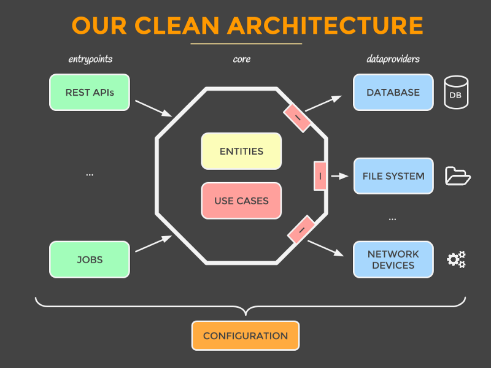

---
## Starting development server
---

1. Create an .env directory in project root, and add following config

```
API_PORT=3000
MONGO_DB_URL=""
 // url for mongodb, for local do not add this, local url is fallback
in config
SECRET_TOKEN = "YOUR_JWT_SECRET_TOKEN"
JWT_EXPIRY = "Expiry in seconds , minute, days , hrs"
```

2. Install Dependencies

```sh
npm install
```

3. Import Products database in yout mongodb

```sh
npm run upload
```

4. Start the dev server

```sh
npm start
```

### Architecture used in this code base

In this codebase , we have used **Clean Architecture** by **Uncle Bob**. You can take image as the reference



### Explaining the structure

- **api** : Where all the http routes are configured. Controllers are defined inside this folder , which is only responsible for controlling the routes

- **commons** : For adding the global configuration which fetch the information from `.env` variables

- **infrastrucutre** : Where the drivers required for database are managed. Each infrastructures is defined to use methods for connecting to the database.

- **models** : Where the schema of the database models are configured

- **scripts** : Utility or external scripts which helps to execute the external script

- **services** : Folder where business logic is defined.

### Want to use the api ?

<a href="https://www.getpostman.com/collections/7049a7389ba8a947a89e">Download the postman collections</a>. And import it in the postman and play with it. Thanks :)
